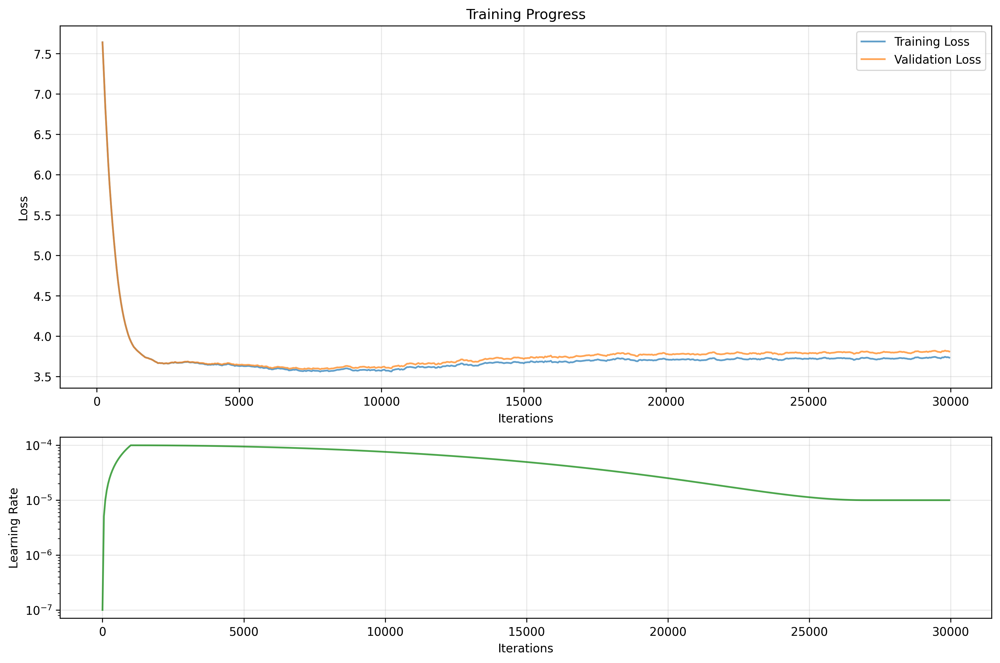

# SmolerGPT: RTX 3050 Edition 🎮

A modified version of SmolGPT optimized to train on consumer GPUs, specifically the NVIDIA RTX 3050 (8GB VRAM). Enjoyed training an LLM for the first time and locally, thanks to the amazing work of Om-Alve on [smolGPT](https://github.com/Om-Alve/smolGPT)!

## Training Results 📊

### Performance Metrics
- **Training Duration**: 30000 iterations
- **Final Training Loss**: 3.7457
- **Final Validation Loss**: 3.8243
- **Best Training Loss**: 3.5345
- **Best Validation Loss**: 3.5659

### Learning Progress

- Initial Loss: ~8.41 → Final Loss: ~3.75
- Convergence around iteration 6000-7000
- Learning rate schedule: 1e-4 → 1e-5

### Model Capabilities
- Basic story continuation
- Simple dialogue generation
- Short-form narrative generation

### Current Limitations
- Tendency to repeat phrases
- Limited context window
- Basic narrative structures

## Implementation & Analysis 🛠️

### 1. Architecture Adaptations
- Reduced context length (256 tokens)
- Fewer transformer layers (6 layers)
- Smaller embedding dimension (384)
- ~12.3M parameters (46.9MB on disk)
- Removed rotary embeddings
- Simplified attention mechanism
- Optimized batch size for 8GB VRAM

### 2. Memory Management
- Gradient accumulation (steps=8)
- Token clamping for CUDA stability
- Optimized evaluation frequency
- Dynamic GPU memory allocation
- Reduced dataset size for faster training

### 3. Data Processing
- Subset of TinyStories dataset (20 files, 0.1 sample rate)
- Dynamic vocabulary size from config
- Simplified tokenizer path handling
- Memory-efficient data loading

### 4. Model Capabilities
- Fast inference on consumer GPU
- Basic story structure understanding
- Grammatically correct sentences
- Dialogue handling with quotes
- Name recognition and usage

### 5. Current Limitations
- Repetitive patterns ("I'm sorry", "Lily")
- Limited context retention
- Fixed story elements (park, playing)
- Memory constraints (256 token context)
- Vocabulary fixation on common patterns


## Quick Start 🚀

1. **Install Requirements (python 3.12)**
```bash
pip install -r requirements.txt
```

2. **Prepare Dataset**
```bash
python preprocess.py prepare-dataset --vocab-size 4096 --num-files 20 --sample-rate 0.1
```
This will:
- Download subset of TinyStories dataset
- Train tokenizer with vocab size 4096
- Process data for training

3. **Start Training**
```bash
python train.py
```

4. **Test the Model (can test while still training)**
```bash
python chat.py
```

## Model Usage 🤖

### Chat Parameters
- Temperature: 0.6 (conservative sampling)
- Top-k: 20 (focused selection)
- Max tokens: preferred to be 32 as repetitions starts afterwards, but it can generate 200 per response

### Visualization
```bash
python plot_loss.py
```
Generates training progress plots and metrics.

### Future Optimizations
- [ ] Repetition penalties
- [ ] Context window experiments
- [ ] Token sampling improvements
- [ ] Memory efficiency tweaks
- [ ] Reinforcement Learning?
- [ ] Regularization
- [ ] Increase training dataset

