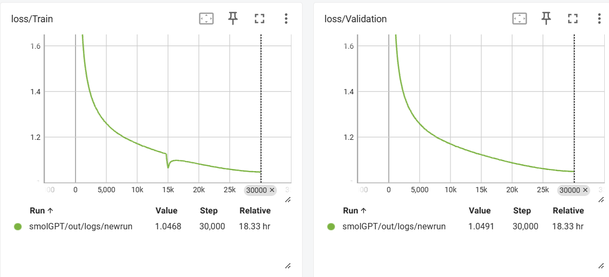

# SMOL-GPT 🦾

A minimal PyTorch implementation for training your own small LLM from scratch. Designed for educational purposes and simplicity, featuring efficient training, flash attention, and modern sampling techniques.

## Features ✨

- **Minimal Codebase**: Pure PyTorch implementation with no abstraction overhead
- **Modern Architecture**: GPT model with:
  - Flash Attention (when available)
  - RMSNorm and SwiGLU
  - Efficient top-k/p/min-p sampling
- **Training Features**:
  - Mixed precision (bfloat16/float16)
  - Gradient accumulation
  - Learning rate decay with warmup
  - Weight decay & gradient clipping
- **Dataset Support**: Built-in TinyStories dataset processing
- **Custom Tokenizer**: SentencePiece tokenizer training integration

## Installation 🛠️

```bash
pip install torch sentencepiece tqdm requests numpy
```

**Requirements**:
- Python 3.8+
- PyTorch 2.0+ with CUDA
- Modern GPU (recommended)

## Quick Start 🚀

### Option 1: Full Training Cycle

1. **Prepare Dataset**
```bash
python preprocess.py prepare-dataset --vocab-size 4096
```

2. **Start Training**
```bash
python train.py
```

3. **Generate Text**
```bash
python sample.py \
    --prompt "Once upon a time" \
    --num_samples 3 \
    --temperature 0.7 \
    --max_new_tokens 500
```

### Option 2: Use Pre-trained Model

1. **Download Assets**
```bash
# Download tokenizer
wget https://huggingface.co/OmAlve/TinyStories-SmolGPT/resolve/main/tok4096.model -P data/

# Download pre-trained checkpoint
wget https://huggingface.co/OmAlve/TinyStories-SmolGPT/resolve/main/ckpt-v1.pt -P out/
```

2. **Run Inference**
```bash
python sample.py \
    --prompt "Once upon a time" \
    --tokenizer_path data/tok4096.model \
    --ckpt_dir out/ \
    --num_samples 3 \
    --max_new_tokens 200 \
    --temperature 0.7
```

## Pre-trained Model Details 🔍

The provided checkpoint was trained on the TinyStories dataset.

Architecture:
- 4096-token vocabulary
- 8 heads
- 8-layer transformer
- 512 embedding dimension
- Trained on `~4 Billion Tokens` for around `18.5` hours

Validation Loss - `1.0491`



## Configuration ⚙️

Key parameters (modify in `config.py`):

**Model Architecture**:
```python
GPTConfig(
    block_size=512,    # Context length
    n_layer=8,         # Number of transformer layers
    n_head=8,          # Number of attention heads
    n_embed=512,       # Embedding dimension
    dropout=0.2,       # Dropout rate
    bias=False         # Use bias in layers
)
```

**Training**:
```python
TrainingConfig(
    batch_size=64,
    max_iters=30000,
    learning_rate=6e-4,
    weight_decay=0.1,
    grad_clip=1.0,
    warmup_iters=1000
)
```

## File Structure 📁

```
om-alve-smolgpt/
├── config.py       - Model & training configuration
├── dataset.py      - Data loading & preprocessing
├── model.py        - GPT model implementation
├── preprocess.py   - Dataset preparation scripts
├── sample.py       - Text generation script
├── tokenizer.py    - Tokenizer wrapper
└── train.py        - Main training loop
```

## Contributing 🤝

Contributions welcome! Please open an issue or PR for:
- Bug fixes
- Performance improvements
- New features

---

**Note**: This implementation is inspired by modern LLM training practices and adapted for educational purposes. For production use, consider scaling up model size and dataset.
```
